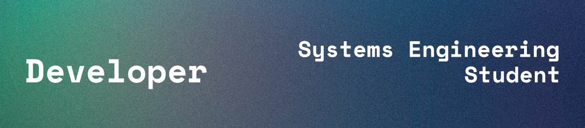
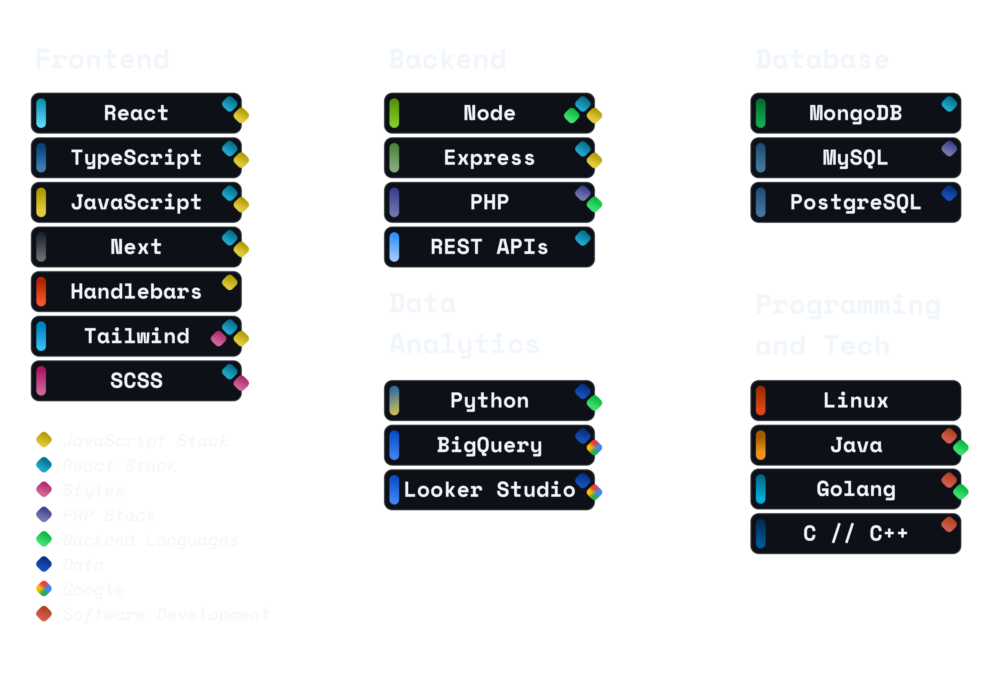



Hi there! I'm an Argentine programmer who's passionate about design and the latest technologies. I strongly believe that systems should adapt to our needs, not the other way around, that's why I focus on solutions that align with user behavior, prioritizing functionality, simplicity, coherence, and flow.

## Skills & Technologies
During my years as a developer, I have worked with various systems and acquired knowledge in the following skills:

 

## Projects
### Poket - ETL & Data Pipeline

**Technologies:** Python, BigQuery, GitHub Actions
* Developed automated data scraping, processing, and ETL pipelines.
* Processed and transformed large-scale datasets for analytics and reporting.
* Integrated data workflows with BigQuery for storage, querying, and analysis.
* Automated deployment and execution processes through CI/CD pipelines using GitHub Actions.

### Asty - Municipal Spending Analytics Platform

**Technologies:** React, Python, PostgreSQL, Pandas, REST APIs
* Developed a data analytics platform focused on municipal spending and budget transparency.
* Processed and analyzed large public expenditure datasets.
* Implemented historical comparisons across fiscal years to identify spending trends and patterns.
* Built data visualization and reporting features to support decision-making.

### Acercándonos Cultura - Reading Platform

**Technologies:** PHP, MySQL, JavaScript, REST APIs
* Worked with large relational databases containing books, authors, and editorial content.
* Optimized and restructured database schemas to improve performance and maintainability.
* Designed and executed complex SQL queries for data management and content operations.
* Contributed to backend integrations and API-driven functionalities.

### Donation Management System

**Technologies:** Java 8+, Spring Boot, Maven, REST APIs, MySQL, MongoDB, MVC Architecture
* Developed a comprehensive platform for managing donors, donations, and beneficiary organizations.
* Implemented business logic for donation allocation, tracking, and lifecycle management.
* Designed and maintained both relational and document-oriented database structures.
* Built notification and status-tracking systems to monitor donation workflows.
* Modeled domain entities and produced technical documentation for platform features.

## Contact

- **Email**: [Juancruzbolatti.t@gmail.com](mailto:juancruzbolatti.t@gmail.com)
- **LinkedIn**: [Juan Cruz Bolatti](https://www.linkedin.com/in/juan-cruz-bolatti/?locale=en_US)
- **Website**: [// juancruzbolatti.com](https://juancruzbolatti.com)

I'm always open to discussing new opportunities, collaborations, or just having a chat!

