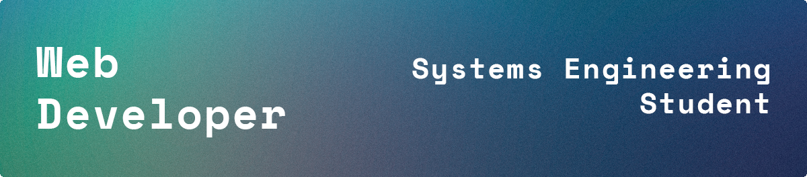
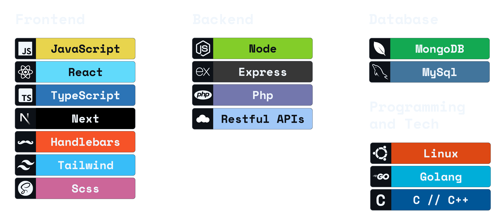

Hi there! I'm an Argentine programmer who's passionate about design and the latest technologies. I strongly believe that systems should adapt to our needs, not the other way around, that's why I focus on solutions that align with user behavior, prioritizing functionality, simplicity, coherence, and flow.

## Skills & Technologies
During my years as a developer, I have worked with various systems and acquired knowledge in the following skills:

 

## Contact

- **Email**: [Juancruzbolatti.t@gmail.com](mailto:juancruzbolatti.t@gmail.com)
- **LinkedIn**: [Juan Cruz Bolatti](https://www.linkedin.com/in/juan-cruz-bolatti/?locale=en_US)
- **Website**: [// juancruzbolatti.com](https://juancruzbolatti.com)

I'm always open to discussing new opportunities, collaborations, or just having a chat!

